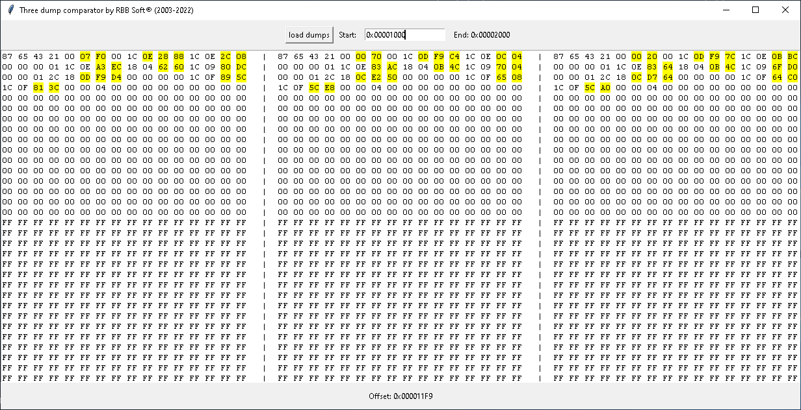

# 3-dump-compare

app checks in python to compare 3 files(dumps) at the same time with the possibility to choose the start offset.

can handle large files because it only uploads 4kb per file

to run it from the cmd does not require dependencies.

feel free to modify and improve the code to your liking.

